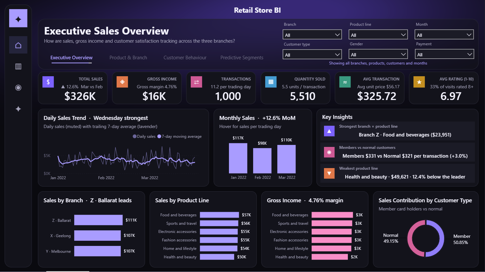
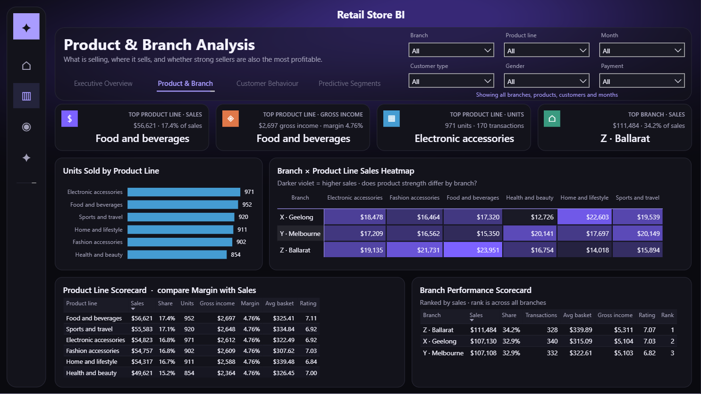
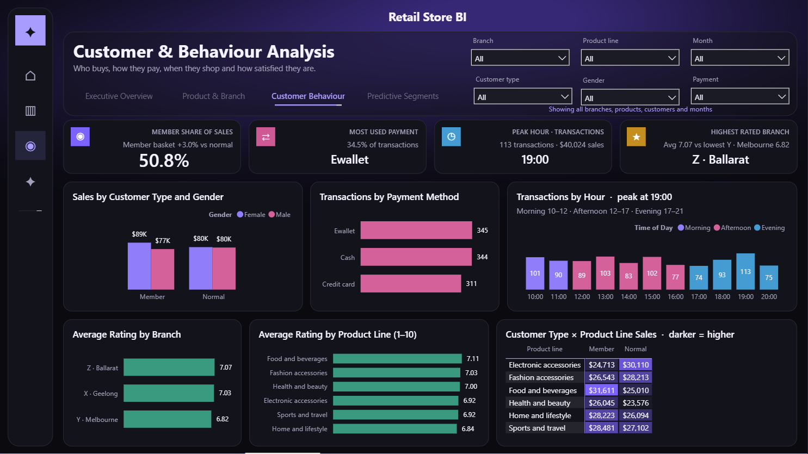
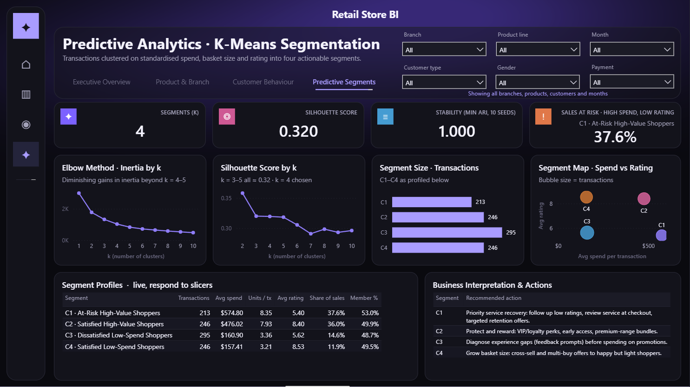
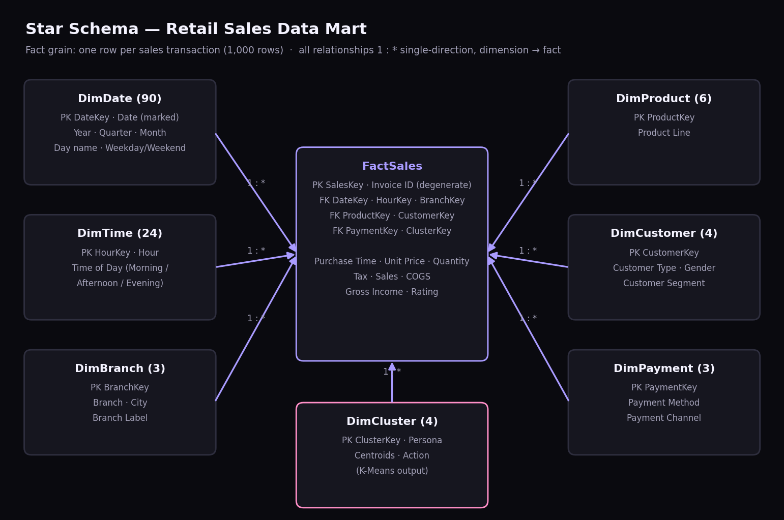

# Retail Store Sales & Customer Segmentation — Power BI

A business intelligence case study for a three-branch retail chain: BI architecture, a
star-schema data mart, Power Query ETL, descriptive dashboards for Retail Store
Directors, and a K-Means segmentation model that feeds back into the report. Built as
code: Power Query → semantic model (TMDL) → report (PBIR), with Python for profiling,
the model and an independent reconciliation of every headline figure. The report was
then finished by hand in Power BI Desktop.



## What it answers

- How sales, gross income and customer satisfaction are tracking across the three
  branches, month by month.
- Which product lines sell most, where they sell, and whether strong sellers are also
  the most profitable.
- Who buys, how they pay, when they shop and how satisfied they are.
- Which groups of transactions matter most commercially, and what to do about each.

## What the data audit found first

The source is a 1,000-row Excel extract (Jan–Mar 2022). It was profiled before
anything was built, and four issues shaped the design:

- **Day and month swapped in 413 dates.** The other 587 dates were text. Every true
  Excel date had a "day" of 1–3 and fell outside the documented period until day and
  month were swapped; after the swap all 1,000 sit inside 1 Jan – 30 Mar 2022.
- **Invoice ID is not a key.** There are 575 distinct IDs over 1,000 rows, yet repeated
  IDs never share a branch, date and time. They are reused IDs, not duplicates, so all
  rows are kept, a surrogate `SalesKey` is the grain, and transactions are counted with
  `COUNTROWS`.
- **Gross income equals the 5% tax on every row**, and the stated gross margin % is a
  constant the data does not reproduce. Margin is recomputed as a measure, and the
  report says plainly that category profitability cannot be separated from sales.
- **COGS = quantity × (unit price − $0.025)** on every row, verified rather than assumed.

## The four pages

| | |
|---|---|
| **Product & Branch** — leaders, branch × product heat-map, scorecards | **Customer Behaviour** — membership, payment, hourly demand, ratings |
|  |  |
| **Predictive Segments** — elbow, silhouette, segment map and actions | |
|  | |

Six slicers (branch, product line, month, customer type, gender, payment) are synced
across every page. Titles and insight cards are DAX-driven and restate themselves under
any filter: "Sales by Branch · Z · Ballarat leads", "Transactions by Hour · peak at 19:00".

## Headline findings

- **$325,722 sales** and $15,517 gross income from 1,000 transactions; average basket
  $325.72; average rating 6.97/10, with only 32.9% of visits rated 8 or above.
- **No clear trend in three months.** February fell 16.4%, but only 7.4% per trading
  day; March recovered 12.6%.
- **Branch Z (Ballarat) leads** on sales (34.2%), basket size and rating while having
  the fewest transactions. Branch Y (Melbourne) has the lowest satisfaction.
- **Food and beverages** leads on sales and gross income; **Health and beauty** trails
  the leader by 12.4%. Product strength differs sharply by branch.
- **The member card does not change behaviour.** Members are 50.8% of sales and spend
  3.0% more per basket.

## Predictive model: K-Means segmentation

Transactions are clustered on standardised spend, basket size and rating. Gross income
is excluded because it is collinear with spend (r = 1.00), and categorical fields are
used to profile the segments rather than forced into Euclidean distance.

- **k = 4** chosen from the elbow curve and silhouette score.
- Silhouette 0.320, which is weak-to-moderate separation and reported as such.
- Identical clusters across 10 random seeds (minimum ARI 1.000).

| Segment | Share of transactions | Share of sales | Avg spend | Avg rating |
|---|---|---|---|---|
| **C1 · At-Risk High-Value** | 21.3% | **37.6%** | $574.80 | **5.40** |
| C2 · Satisfied High-Value | 24.6% | 36.0% | $476.02 | 8.40 |
| C3 · Dissatisfied Low-Spend | 29.5% | 14.6% | $160.90 | 5.62 |
| C4 · Satisfied Low-Spend | 24.6% | 11.9% | $157.41 | 8.53 |

The biggest baskets carry the lowest satisfaction, and that one segment holds over a
third of revenue. Membership is ~50% in every segment. Demand forecasting was
considered and rejected: one quarter of daily data cannot support a forecast worth
presenting.

## Model

| | |
|---|---|
| **Stack** | Excel → Power Query (raw → staging → star schema) → semantic model (TMDL) → report (PBIR); Python (pandas, scikit-learn) |
| **Model** | FactSales (grain: one transaction) + 7 dimensions (Date, Time, Branch, Product, Customer, Payment, Cluster); 7 one-to-many single-direction relationships; marked date table |
| **Measures** | 91 explicit DAX measures in 6 display folders; numeric fact columns hidden |
| **Report** | 4 pages, synced slicers, page navigation, dark theme with a validated colour-blind-safe palette |



## Evidence

| Check | Result |
|---|---|
| Rows in = rows in FactSales | **1,000 = 1,000**, no row loss |
| Fact rows with an unmatched dimension key | **0** across all 7 relationships |
| Total sales, gross income, COGS, quantity, rating and monthly sales vs an independent Python recalculation (`outputs/kpi_validation.csv`) | **Identical** |
| Arithmetic identities (tax, COGS, total, gross income) | **1,000 of 1,000** rows |
| K-Means stability across 10 seeds | **ARI 1.000** |

## Repository layout

```
ICT701 Assignment1_RetailStore_Dataset (1).xlsx   source extract
RetailStore_BI.pbip                                 open this in Power BI Desktop
RetailStore_BI.SemanticModel/definition/            TMDL: ETL queries, tables, relationships, measures
RetailStore_BI.Report/                              PBIR pages and visuals, theme, background
scripts/
  01_profile_and_clean.py      profiling + cleaned extract (mirrors the Power Query rules)
  02_customer_segmentation.py  K-Means model -> outputs/*.csv (loaded by Power BI)
  03_validate_kpis.py          independent recalculation of every KPI
  04_build_report.py           generated the base report layout + theme (guarded: needs --force)
  05_diagrams.py               architecture and star-schema diagrams
outputs/                       model results, validation, diagrams, page screenshots
documentation/                 architecture, warehouse design, ETL & data quality,
                               DAX catalogue, insights & recommendations, model, evidence
```

## Open it

1. Open `RetailStore_BI.pbip` in Power BI Desktop.
2. Set the folder path: *Transform data → Manage parameters → `ProjectFolder`* = the
   folder holding this README, ending with `\`.
3. **Refresh.** A Power BI Project stores no data, so visuals are empty until the
   first refresh.

To re-run the analytics:

```
pip install pandas openpyxl scikit-learn matplotlib pillow
python scripts/01_profile_and_clean.py
python scripts/02_customer_segmentation.py
python scripts/03_validate_kpis.py
```

## Documentation

- [BI architecture](documentation/BI_Architecture.md) — layers, refresh, security, scalability, governance
- [Data warehouse design](documentation/Data_Warehouse_Design.md) — grain, tables, keys, relationships
- [ETL & data quality](documentation/ETL_Documentation.md) — every issue found and every transformation
- [DAX measure catalogue](documentation/DAX_Measures.md) — all 91 measures with formulas
- [Insights & recommendations](documentation/Dashboard_Insights.md) — findings, eight recommendations, limitations
- [Predictive model](documentation/Predictive_Model.md) — method, model selection, results, limitations
