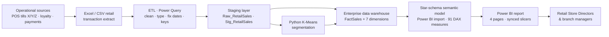

# Business Intelligence System Architecture

Diagram: [`outputs/diagram_bi_architecture.png`](../outputs/diagram_bi_architecture.png)

## Layer by layer: how data is collected, processed, stored and delivered

| Layer | Prototype implementation (this project) | Production equivalent |
|---|---|---|
| **1. Operational / source systems** | Supplied Excel workbook (1,000 transactions, 3 branches, Jan–Mar 2022) | POS systems in each branch, loyalty-card platform, payment gateways (cash, card, e-wallet) |
| **2. Collection / extraction** | `Raw_RetailSales` reads the workbook through `Excel.Workbook` | Nightly extract of the previous day's transactions (files or database CDC) to a landing zone |
| **3. ETL / transformation** | Power Query `Stg_RetailSales` (see [ETL_Documentation.md](ETL_Documentation.md)): rename, de-duplicate, repair dates, type, standardise text, derive keys | Same rules in Dataflows Gen2 / SQL stored procedures, with logged rejects |
| **4. Staging** | Unloaded staging queries (Raw → Stg) | `stg` schema, reloaded each run, kept for audit |
| **5. Data warehouse** | Star schema inside the Power BI model | `dw` schema: FactSales + conformed dimensions; SCD2 on branch/product |
| **6. Advanced analytics** | `scripts/02_customer_segmentation.py` (scikit-learn K-Means) writes CSVs that Power Query loads as DimCluster | Scheduled notebook writing segment scores back to the warehouse |
| **7. Semantic model** | Power BI import model with 91 explicit measures and a marked date table | Certified, shared semantic model in the Power BI Service |
| **8. Presentation / delivery** | 4-page dashboard: Executive, Product & Branch, Customer, Predictive | Power BI app for directors; e-mail subscriptions; mobile layout |
| **9. Users / decisions** | Retail Store Directors | Directors (all branches), branch managers (own branch via RLS), marketing, operations |

## Cross-cutting concerns

* **Refresh**: the prototype refreshes on demand in Desktop. In production, a scheduled refresh through an on-premises data gateway runs after the nightly POS extract. Incremental refresh on `DimDate[Date]` keeps refresh time flat as history grows.
* **Data quality**: rules are encoded in the ETL (date repair, exact-duplicate removal only, type enforcement, key resolution). Reconciliation of row counts and totals against an independent recalculation (`scripts/03_validate_kpis.py`) runs after every load. A `Distinct Invoice IDs` measure keeps the known source issue visible.
* **Security / access**: workspace roles (Admin / Member / Viewer). A row-level security role filters `DimBranch` for branch managers, while directors see all branches. Sensitivity label "Internal".
* **Scalability**: the star schema with integer keys and VertiPaq compression handles millions of rows. When volume grows, the Excel source is replaced by the warehouse tables; aggregations or DirectQuery for the fact can be added without changing the report.
* **Governance**: the model and report are saved as a Power BI Project (PBIP/TMDL/PBIR text files), so changes can be version-controlled and peer-reviewed. Measures carry descriptions and display folders. The dataset is endorsed as *Certified* once reviewed. A data dictionary is in [Data_Warehouse_Design.md](Data_Warehouse_Design.md) and [DAX_Measures.md](DAX_Measures.md).
