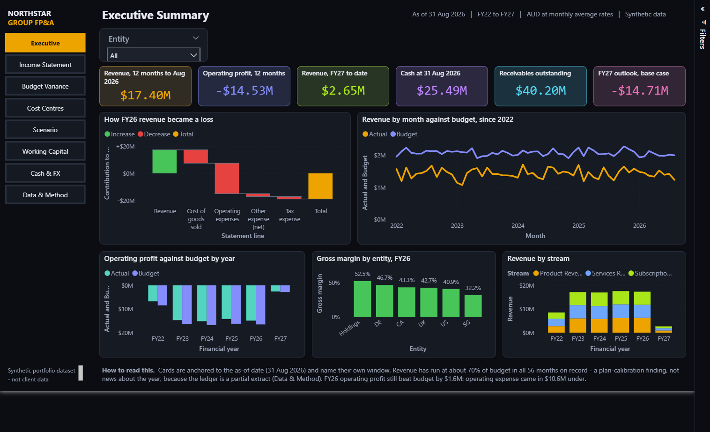
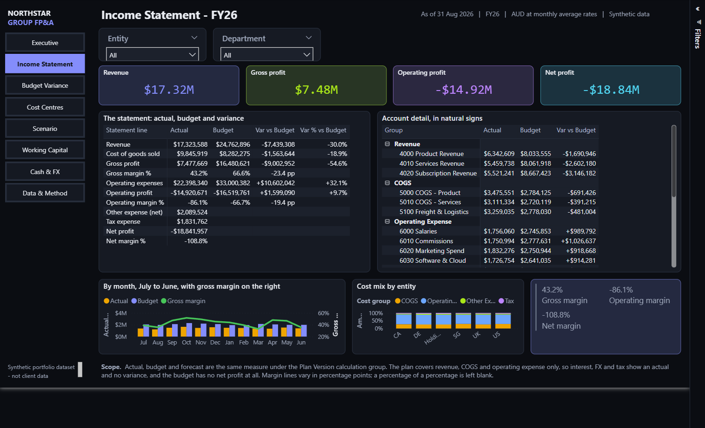
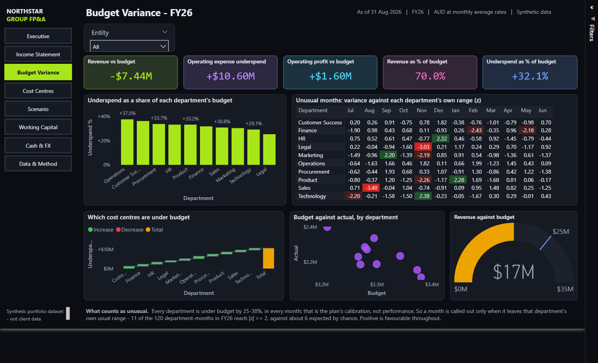
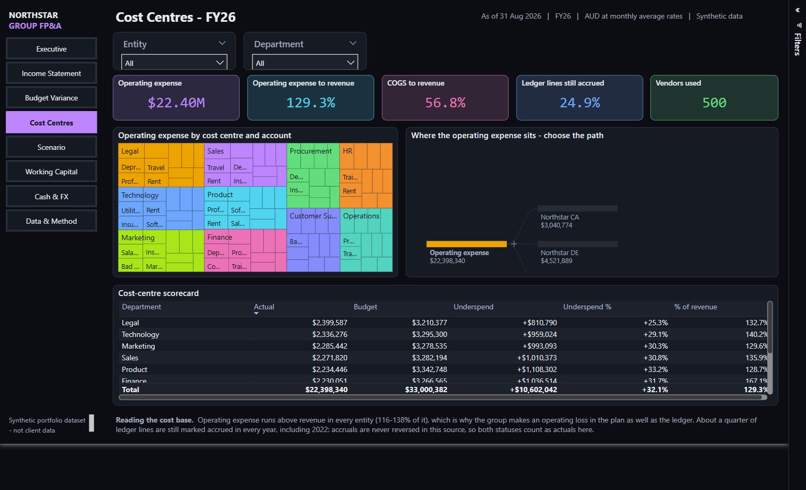
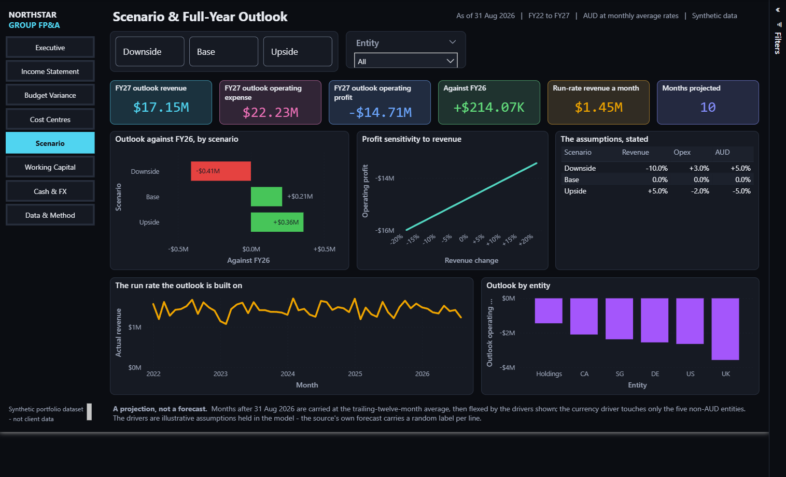
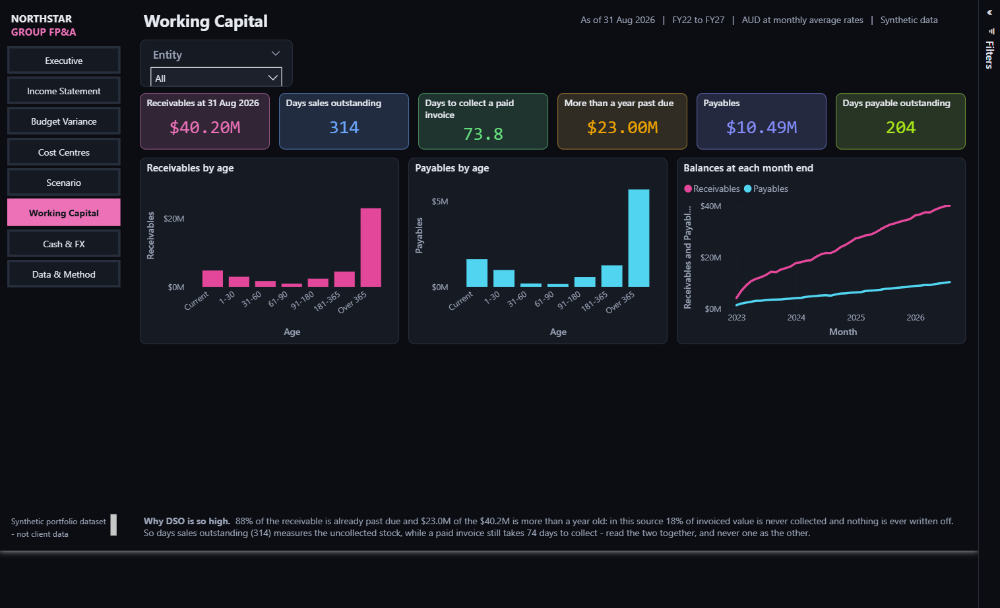
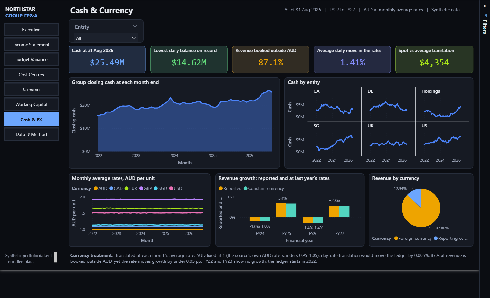
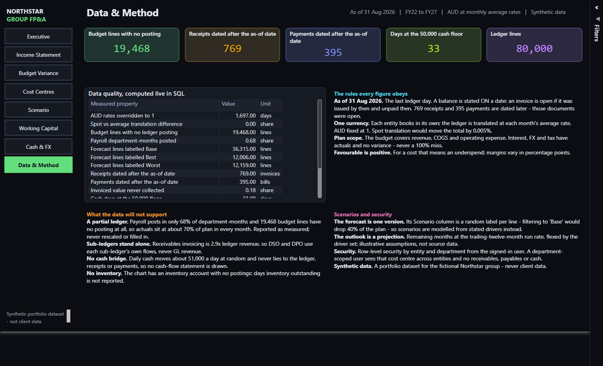

# Power BI Projects

Business intelligence work by [Haroon K.](https://github.com/HaroonBangash) — data
platform, semantic model and report, built end to end.

The projects below are **built as code**: the SQL Server schema, the Power BI semantic
model (TMDL) and the report pages (PBIR) are all generated by Python and checked into
Git. Nothing is authored by clicking in Power BI Desktop, which means the model is
reviewable line by line, diffs like source, and every number is re-verified against
independently written SQL on each build.

> All datasets are **synthetic and portfolio-safe**. Nothing here is real company data.

---

## Enterprise FP&A — group financial planning and analysis

Six entities, six currencies. Actual vs budget vs forecast, FX translation, scenario
planning, working capital and cash — eight report pages over a SQL Server star schema.

| | |
|---|---|
| **Stack** | SQL Server → Power Query → semantic model (TMDL) → report (PBIR) |
| **Model** | 20 tables, 2 calculation groups, 133 measures, dynamic RLS by entity and department |
| **Report** | 8 pages, 193 visuals, 22 visual types |
| **Verified** | **2,088 automated checks**, 0 failures |

What it is careful about: one as-of date with balances computed from dates rather than
status flags; each ledger line translated at its own month's average rate;
like-for-like plan comparison that stops at operating profit, because the budget has no
interest, FX or tax lines; and a ledger that is a partial extract — measured, reported
and labelled, never quietly rescaled.

**→ [Read the project](01-enterprise-fpa-finance/)**

The other seven pages

| | |
|---|---|
| Income Statement | Budget Variance |
|  |  |
| Cost Centres | Scenario |
|  |  |
| Working Capital | Cash & FX |
|  |  |
| Data & Method | |
|  | |

---

## Also in this portfolio

Four further projects built the same way, to be added here:

| Project | What it covers |
|---|---|
| Supply Chain Control Tower | Inventory, logistics, service levels |
| Omnichannel Marketing Attribution | Multi-touch attribution across channels |
| SaaS Revenue, Retention & Churn | Cohort retention, MRR movement, unit economics |
| Healthcare Claims & Revenue Cycle | AR ageing, denial analytics, RLS by facility |

---

## Earlier reports

Standalone `.pbix` files from earlier work. Download and open in Power BI Desktop —
GitHub cannot preview them in the browser.

| File | Subject |
|---|---|
| `Adventure_work PBI (1).pbix` | Adventure Works sales and profitability |
| `Food Delivery Analytics.pbix` | Delivery operations |
| `HR Analytics.pbix` | Workforce and attrition |
| `Market Campaign Analytics.pbix` | Campaign performance |
| `Pharmacueticals company.pbix` | Pharmaceutical sales |
| `Pwc_project.pbix` | PwC virtual internship |
| `Spotify Project PBI.pbix` | Listening data |
| `s&p 500.pbix` | Index constituents and returns |

---

## Licence

[MIT](LICENSE) for the code. Datasets are synthetic, included so each build is
reproducible from a clone.
