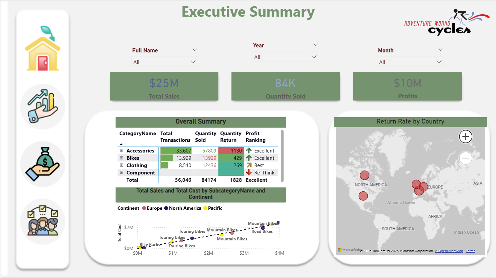
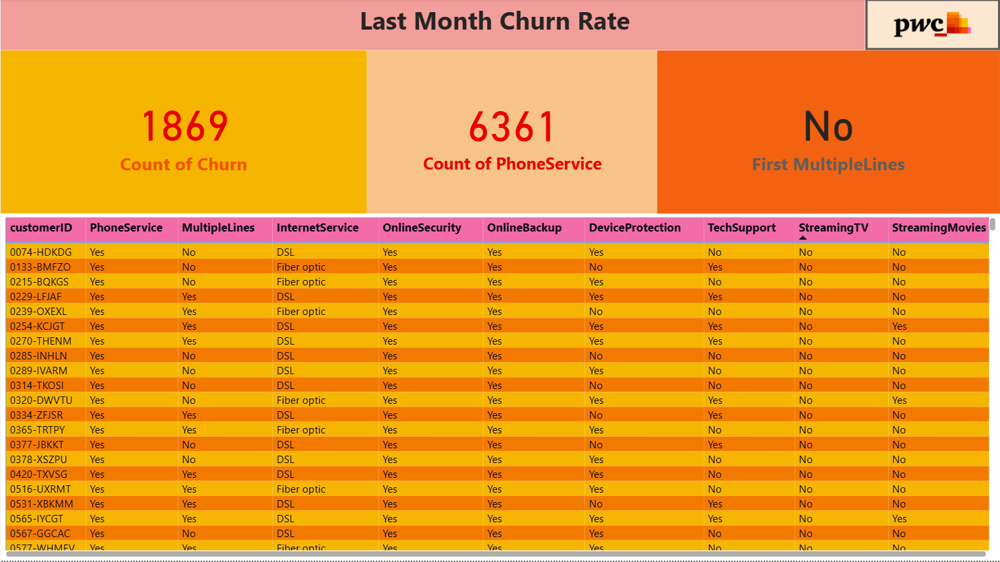
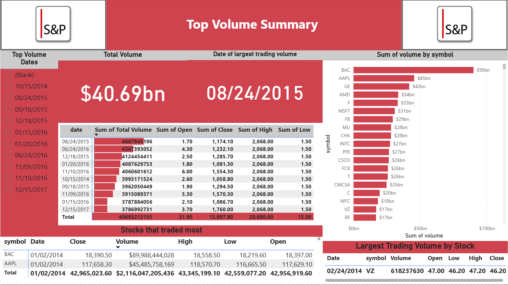
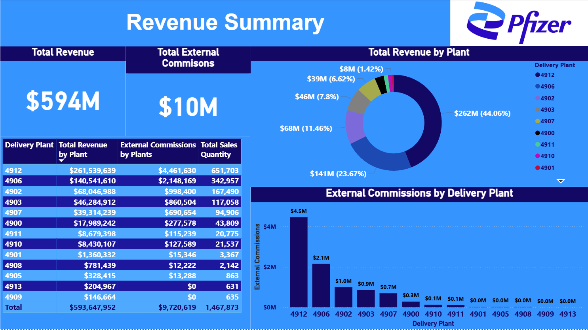
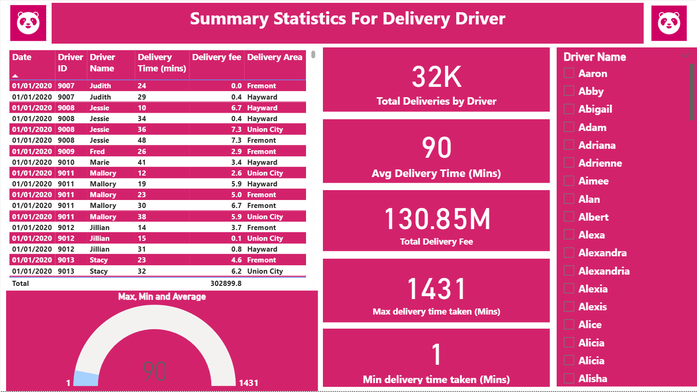
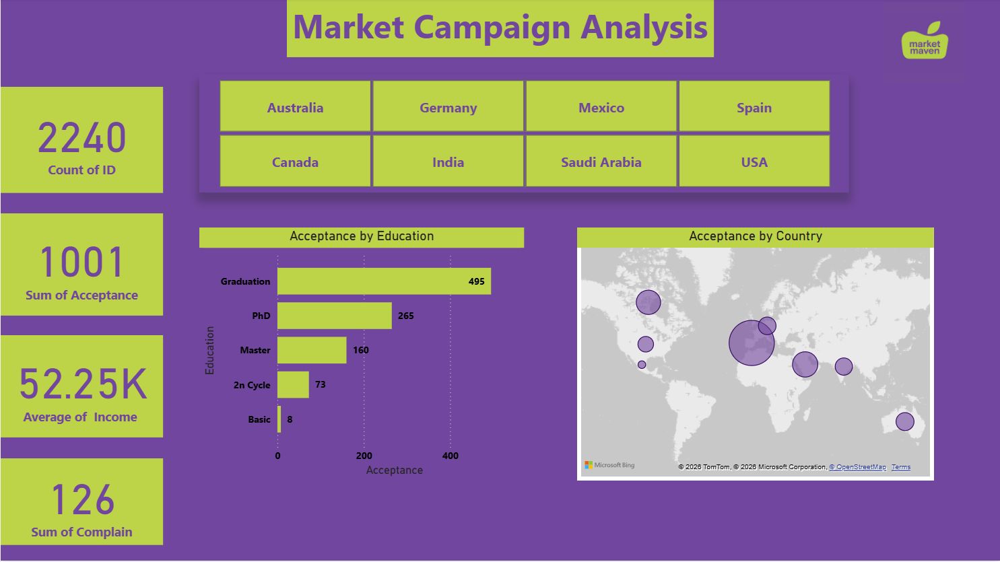

# Earlier reports

Eight Power BI reports built before the five projects in the root of this repository.
They are kept here as a record of earlier work, each one documented and captured page
by page.

**8 reports, 61 pages, 143 DAX measures.** Every page below is a
screenshot of the report rendering its own data.

> **How these differ from the five main projects.** These are `.pbix` files authored in
> the Power BI interface. There is no SQL build, no generated semantic model, no
> automated validation and no reproducible pipeline - the five projects in the root have
> all of that, and the numbers they publish are reconciled against independently written
> SQL. Nothing of that kind is claimed here.

> **The data is inside each file.** The models are imported, so every report opens and
> renders in Power BI Desktop without its original source dataset. GitHub cannot preview
> a `.pbix` in the browser - download it and open it in Desktop.

---

| Report | What it covers | Pages | Measures | Size |
|---|---|---:|---:|---:|
| **[Adventure Works Sales](adventure-works-sales/)** | Bike-retailer sales and returns, plus a 19-page DAX technique workbook | 23 | 51 | 8.5 MB |
| **[PwC Telecom Churn](pwc-telecom-churn/)** | Telecom churn - the PwC Switzerland virtual internship | 4 | 16 | 0.7 MB |
| **[S&P 500 Market Analysis](sp500-market-analysis/)** | Four years of S&P 500 prices: volume, volatility, gainers | 4 | 2 | 16.2 MB |
| **[Spotify Audio Features](spotify-audio-features/)** | 91 scatter charts asking which audio features move together | 15 | 14 | 0.2 MB |
| **[Pharmaceutical Sales](pharmaceutical-sales/)** | Distribution revenue by country, disease and plant | 5 | 20 | 0.2 MB |
| **[Food Delivery Analytics](food-delivery-analytics/)** | Delivery operations by driver, restaurant, city and hour | 5 | 18 | 4.5 MB |
| **[Marketing Campaign Analytics](marketing-campaign-analytics/)** | Campaign response and the drivers of web purchases | 3 | 6 | 1.8 MB |
| **[HR Analytics](hr-analytics/)** | Interview outcomes, and whether consultation moved them | 2 | 16 | 0.2 MB |

---

## [Adventure Works Sales](adventure-works-sales/)

Bike-retailer sales and returns, plus a 19-page DAX technique workbook. 23 pages, 8 tables, 51 DAX measures.

**[Read the write-up](adventure-works-sales/)**

---

## [PwC Telecom Churn](pwc-telecom-churn/)

Telecom churn - the PwC Switzerland virtual internship. 4 pages, 5 tables, 16 DAX measures.

**[Read the write-up](pwc-telecom-churn/)**

---

## [S&P 500 Market Analysis](sp500-market-analysis/)

Four years of S&P 500 prices: volume, volatility, gainers. 4 pages, 11 tables, 2 DAX measures.

**[Read the write-up](sp500-market-analysis/)**

---

## [Spotify Audio Features](spotify-audio-features/)

91 scatter charts asking which audio features move together. 15 pages, 3 tables, 14 DAX measures.

**[Read the write-up](spotify-audio-features/)**

---

## [Pharmaceutical Sales](pharmaceutical-sales/)

Distribution revenue by country, disease and plant. 5 pages, 4 tables, 20 DAX measures.

**[Read the write-up](pharmaceutical-sales/)**

---

## [Food Delivery Analytics](food-delivery-analytics/)

Delivery operations by driver, restaurant, city and hour. 5 pages, 5 tables, 18 DAX measures.

**[Read the write-up](food-delivery-analytics/)**

---

## [Marketing Campaign Analytics](marketing-campaign-analytics/)

Campaign response and the drivers of web purchases. 3 pages, 2 tables, 6 DAX measures.

**[Read the write-up](marketing-campaign-analytics/)**

---

## [HR Analytics](hr-analytics/)

Interview outcomes, and whether consultation moved them. 2 pages, 6 tables, 16 DAX measures.

**[Read the write-up](hr-analytics/)**

---
