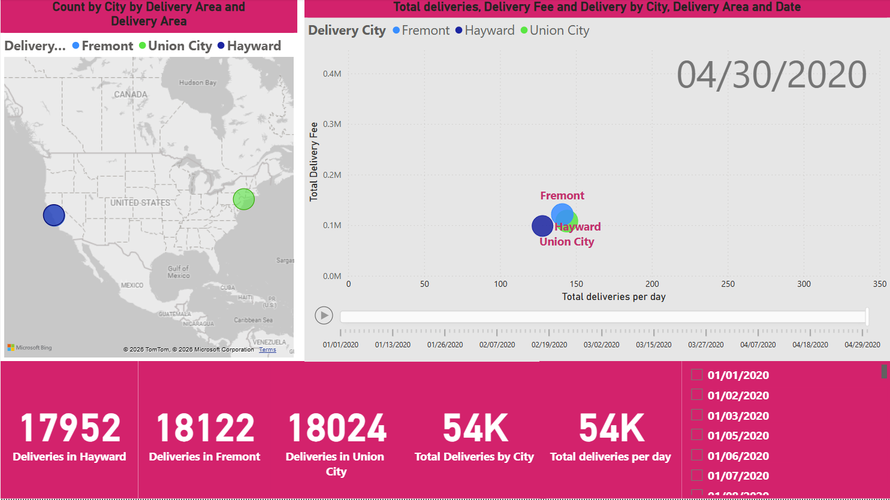
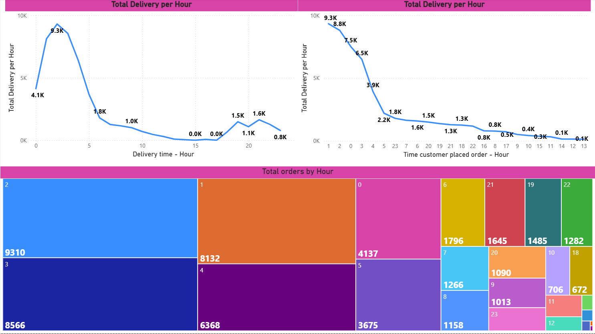
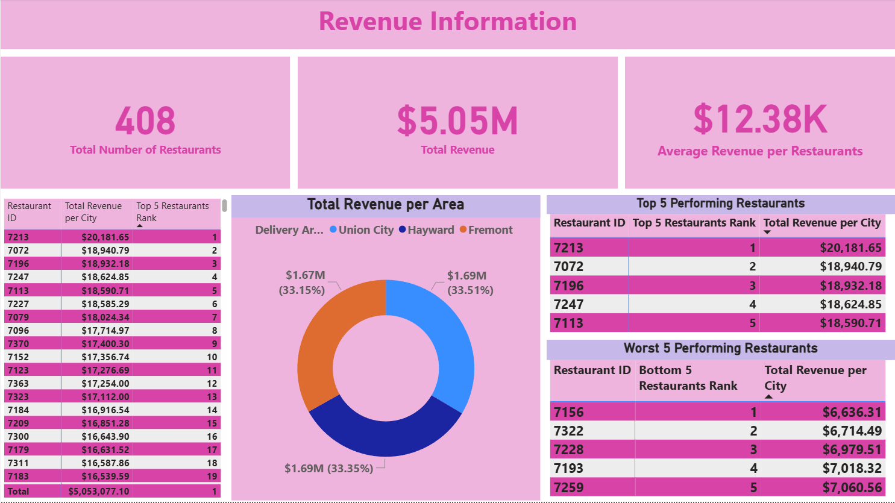
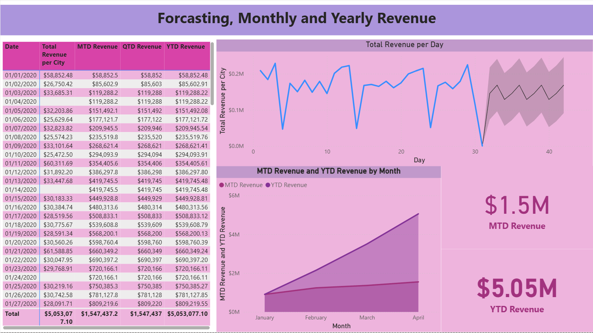

# Food Delivery Analytics

Delivery operations by driver, restaurant, city and hour.


---

## About

Five pages over a delivery dataset: driver summary statistics, delivery patterns across
regions, active hours, revenue, and a closing insights page.

The measures are operational rather than financial - `Average Time Taken by each Driver`,
`Max Time taken by any driver`, `Min time taken by driver`, `Total Deliveries by Each
Driver`, `Total Delivery per Hour`, `Total deliveries per day` - alongside revenue cuts
per city and per restaurant and a top/bottom five restaurant ranking. A separate
`Hours Active` table supports the hour-of-day view, and month-, quarter- and
year-to-date revenue come from a dedicated time-intelligence table.

---

## Contents

| | |
|---|---|
| **Pages** | 5 documented |
| **Visual types** | 14 - card, pivotTable, textbox, lineChart, slicer, image, actionButton, tableEx, ... |
| **Model** | 5 tables, 18 DAX measures, 31 distinct fields on the pages |
| **File** | [`Food Delivery Analytics.pbix`](Food%20Delivery%20Analytics.pbix) - 4.5 MB |

> **The data is inside the file.** The model is imported, so the report opens and
> renders in Power BI Desktop without the original source dataset, which is not
> included here.

---

## Every page

**1. Summary Statistic For Driver** - 13 visuals


**2. Pattern Between deliveries across various Region ** - 8 visuals



**3. Active Hours** - 3 visuals



**4. Revenue Info** - 8 visuals



**5. Other Insights** - 6 visuals



---

## DAX measures

Read out of the report definition, so this is what the pages actually use:

```
Average Revenue per Restaurants, Average Time Taken by each Driver, Bottom 5 Restaurants Rank, Count by City, Count of Fremont, Count of Union City, Hayward, MTD Revenue, Max Time taken by any driver, Min time taken by driver, QTD Revenue, Top 5 Restaurants Rank, Total Deliveries by Each Driver, Total Delivery Fee, Total Delivery per Hour, Total Revenue per City, Total deliveries per day, YTD Revenue
```

## Status

Earlier work, kept for the record. There is no build script, no automated
validation and no reproducible data pipeline here - unlike the five projects in
the root of this repository. What is documented above was read directly out of
the `.pbix`, and every screenshot is the report rendering its own embedded data.
