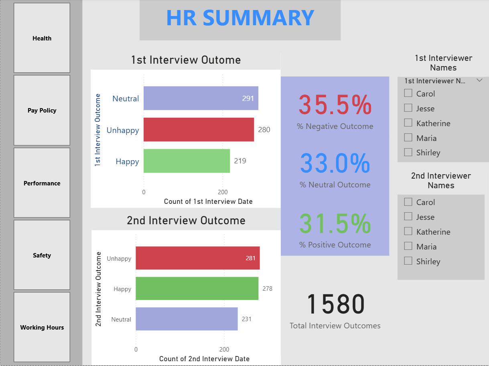
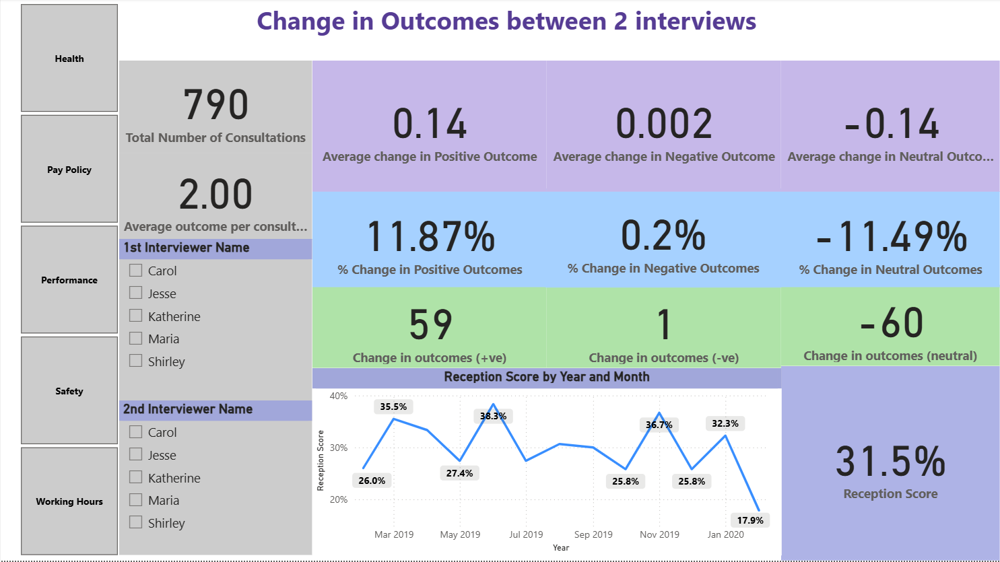

# HR Analytics

Interview outcomes, and whether consultation changes them.



---

## About

Two pages, and the second is the interesting one. The first summarises 1,580 interview
outcomes split Happy / Neutral / Unhappy across a first and second interviewer, with
slicers on both interviewers and on the topic - health, pay policy, performance, safety,
working hours.

The second page asks whether the consultation between the two interviews moved the
outcome. The measures are built as a matched before-and-after: `Change in outcomes (+ve)`,
`(-ve)` and `(neutral)` count the moves, `% Change in ...` expresses each as a share, and
`Average outcome per consultation` divides by the number of consultations rather than by
the headcount. Separate `1st Interviewer` and `2nd Interviewer` tables let the same person
be filtered independently in each role.

---

## Contents

| | |
|---|---|
| **Pages** | 2 documented |
| **Visual types** | 5 - card, slicer, clusteredBarChart, textbox, lineChart |
| **Model** | 6 tables, 16 DAX measures, 26 distinct fields on the pages |
| **File** | [`HR Analytics.pbix`](HR%20Analytics.pbix) - 0.2 MB |

> **The data is inside the file.** The model is imported, so the report opens and
> renders in Power BI Desktop without the original source dataset, which is not
> included here.

---

## Every page

**1. HR Summary** - 10 visuals


**2. Change in Outcomes** - 17 visuals



---

## DAX measures

Read out of the report definition, so this is what the pages actually use:

```
% Change in Negative Outcomes, % Change in Neutral Outcomes, % Change in Positive Outcomes, % Negative Outcome, % Neutral Outcome, % Positive Outcome, Average change in Negative Outcome, Average change in Neutral Outcome, Average change in Positive Outcome, Average outcome per consultation, Change in outcomes (+ve), Change in outcomes (-ve), Change in outcomes (neutral), Reception Score, Total Interview Outcomes, Total Number of Consultations
```

## Status

Earlier work, kept for the record. There is no build script, no automated
validation and no reproducible data pipeline here - unlike the five projects in
the root of this repository. What is documented above was read directly out of
the `.pbix`, and every screenshot is the report rendering its own embedded data.
