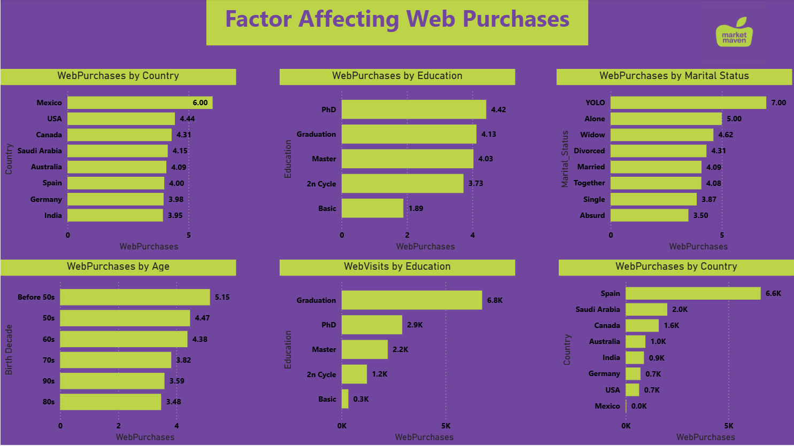
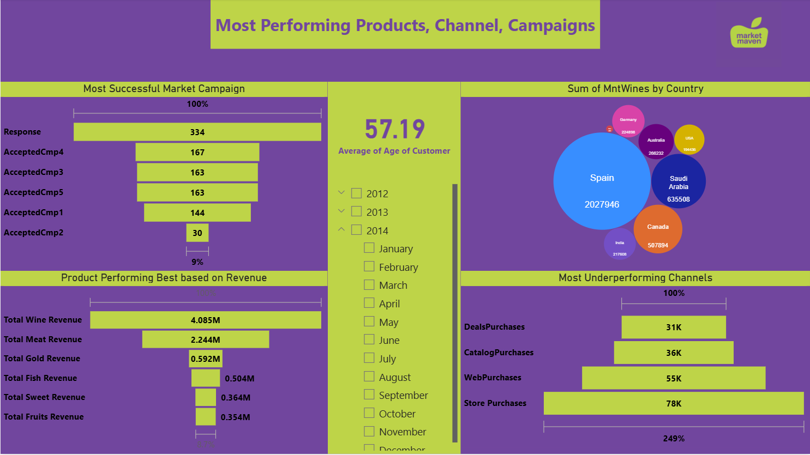

# Marketing Campaign Analytics

Campaign response, and what actually drives web purchases.


---

## About

Three pages over the Maven marketing dataset: campaign analysis, factors affecting web
purchases, and a closing insights page, with a tooltip page behind them.

Revenue is split by product category through six measures - `Total Wine Revenue`,
`Total Meat Revenue`, `Total Gold Revenue`, `Total Fish Revenue`, `Total Fruits Revenue`
and `Total Sweet Revenue` - and read against customer attributes, with a funnel for
campaign response, a packed-bubble chart and a map.

---

## Contents

| | |
|---|---|
| **Pages** | 3 documented of 4 (tooltip pages excluded) |
| **Visual types** | 10 - card, clusteredBarChart, actionButton, textbox, image, funnel, slicer, map, ... |
| **Model** | 2 tables, 6 DAX measures, 27 distinct fields on the pages |
| **File** | [`Market Campaign Analytics.pbix`](Market%20Campaign%20Analytics.pbix) - 1.8 MB |

> **The data is inside the file.** The model is imported, so the report opens and
> renders in Power BI Desktop without the original source dataset, which is not
> included here.

---

## Every page

**1. Market Campaign Analysis** - 10 visuals


**2. Factors Affecting Web Purchases** - 10 visuals



**3. Other Insight** - 9 visuals



---

## DAX measures

Read out of the report definition, so this is what the pages actually use:

```
Total Fish Revenue, Total Fruits Revenue, Total Gold Revenue, Total Meat Revenue, Total Sweet Revenue, Total Wine Revenue
```

## Status

Earlier work, kept for the record. There is no build script, no automated
validation and no reproducible data pipeline here - unlike the five projects in
the root of this repository. What is documented above was read directly out of
the `.pbix`, and every screenshot is the report rendering its own embedded data.
