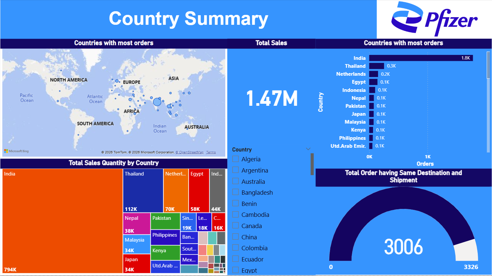
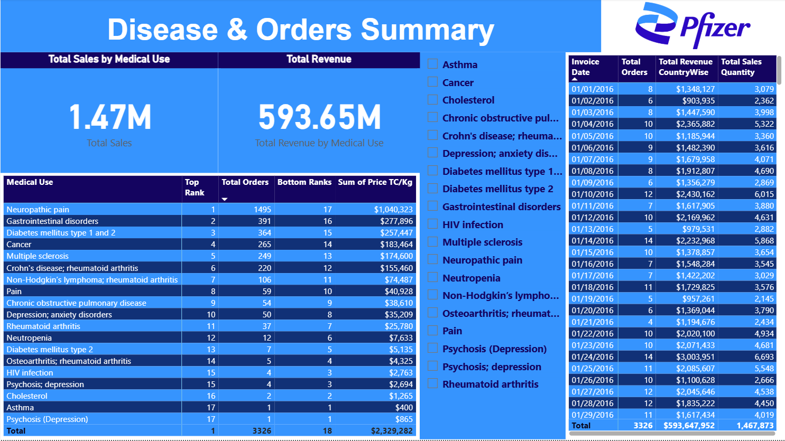
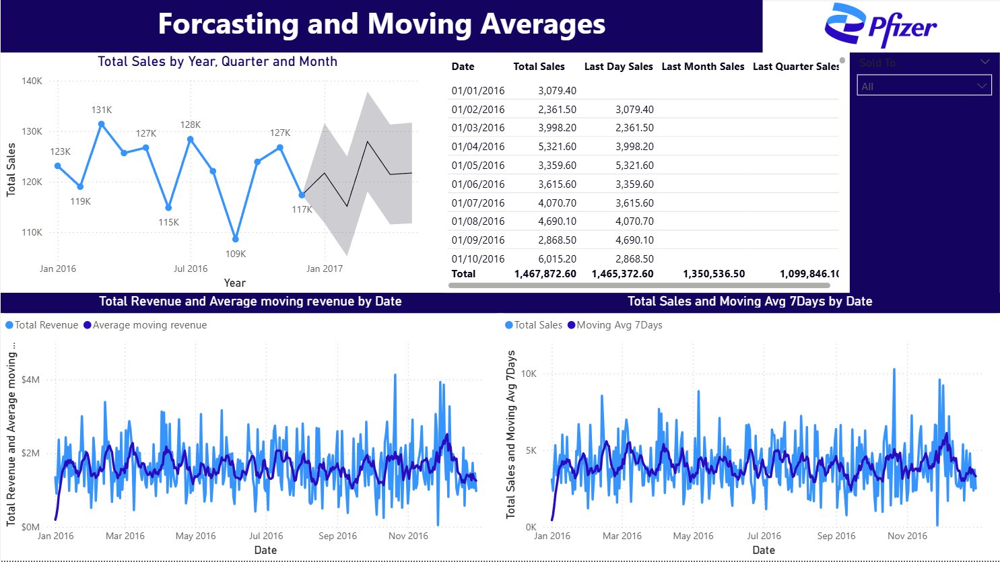
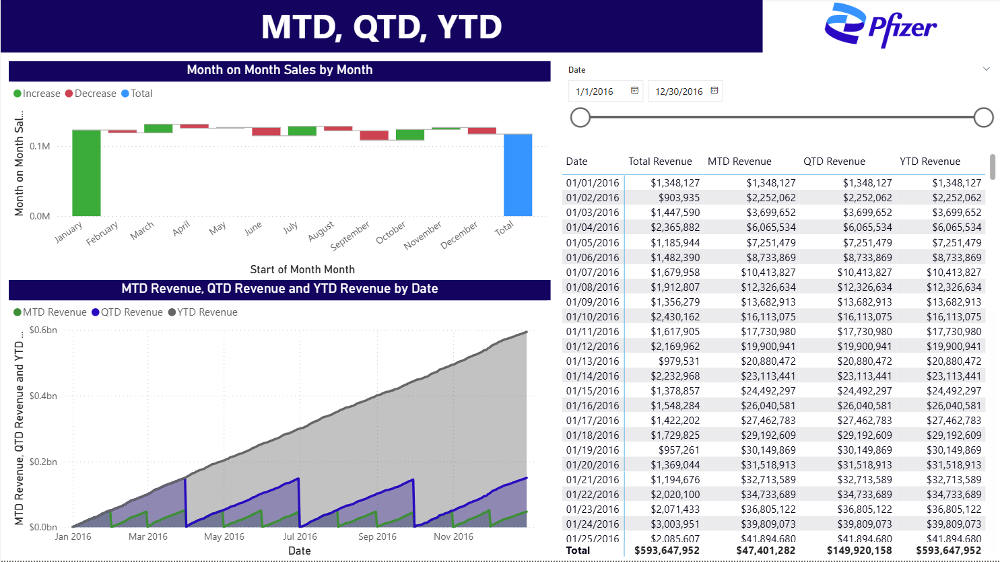

# Pharmaceutical Sales

Pharmaceutical distribution revenue by country, disease and plant.


---

## About

Five pages: revenue summary, country summary, disease summary, a forecasting and
moving-average page, and a month/quarter/year-to-date page, with a tooltip page behind
them.

The time intelligence is the substance here, held in its own table: `Last Day Sales`,
`Last Month Sales`, `Last Quarter Sales`, `Month on Month Sales`, `MTD Revenue`,
`QTD Revenue`, `YTD Revenue`, a `Moving Avg 7Days` and an `Average moving revenue`
driving the forecast page. The cuts are `Total Revenue by Medical Use`,
`Total Revenue by Plant` and `Total Revenue CountryWise`, with top-ten and bottom-ten
order rankings by medical type.

---

## Contents

| | |
|---|---|
| **Pages** | 5 documented of 6 (tooltip pages excluded) |
| **Visual types** | 15 - card, actionButton, pivotTable, image, textbox, slicer, lineChart, donutChart, ... |
| **Model** | 4 tables, 20 DAX measures, 35 distinct fields on the pages |
| **File** | [`Pharmacueticals company.pbix`](Pharmacueticals%20company.pbix) - 0.2 MB |

> **The data is inside the file.** The model is imported, so the report opens and
> renders in Power BI Desktop without the original source dataset, which is not
> included here.

---

## Every page

**1. Revenue Summary** - 8 visuals


**2. Country Summary** - 9 visuals



**3. Disease Summary** - 9 visuals



**4. Forcasting,Moving Averages** - 8 visuals



**5. MTD,QTD,YTD** - 7 visuals



---

## DAX measures

Read out of the report definition, so this is what the pages actually use:

```
Average moving revenue, Bottom 10 Orders Based on Medical Type, Countries with most orders, Last Day Sales, Last Month Sales, Last Quarter Sales, MTD Revenue, Month on Month Sales, Moving Avg 7Days, Orders With Same Destination, QTD Revenue, Top 10 Orders Based on Medical Type, Total Orders, Total Revenue, Total Revenue CountryWise, Total Revenue by Medical Use, Total Revenue by Plant, Total Sales, Total Sales Quantity, YTD Revenue
```

## Status

Earlier work, kept for the record. There is no build script, no automated
validation and no reproducible data pipeline here - unlike the five projects in
the root of this repository. What is documented above was read directly out of
the `.pbix`, and every screenshot is the report rendering its own embedded data.
