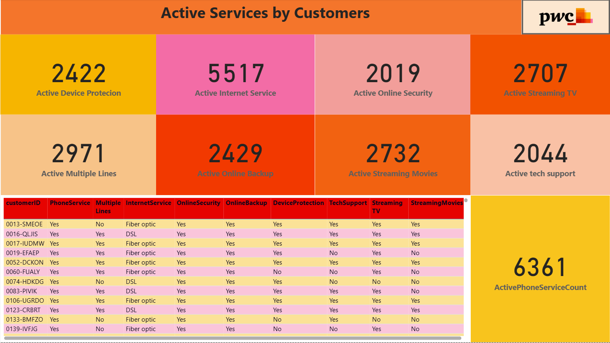
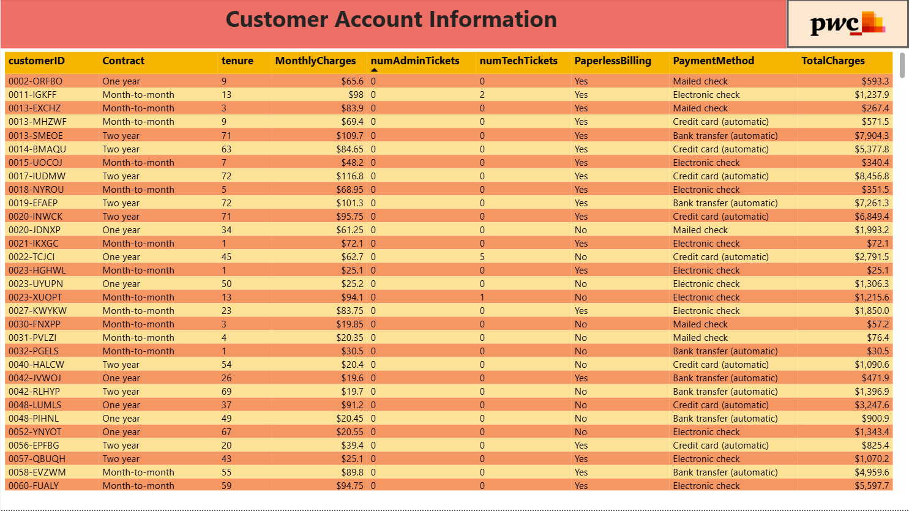
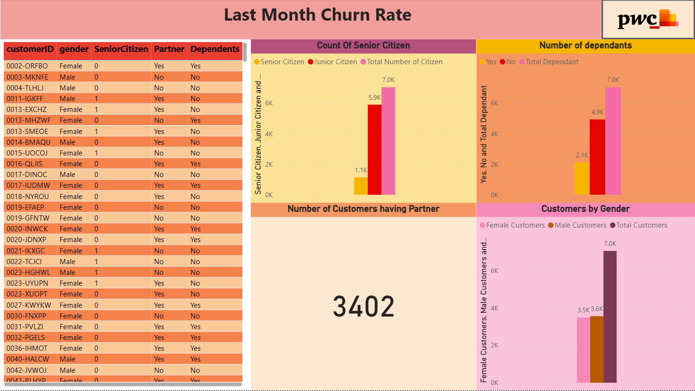

# PwC Telecom Churn

Telecom customer churn - the PwC Switzerland virtual internship.


---

## About

Four pages built for the PwC Switzerland Power BI virtual internship: last month's churn
rate, active services by customer, customer account information, and demographics.

The headline is 1,869 churned customers against 6,361 with phone service. The service
take-up measures are counted individually rather than from one column - `Active Internet
Service`, `Active Online Security`, `Active Online Backup`, `Active Device Protection`,
`Active tech support`, `Active Streaming TV`, `Active Streaming Movies`, `Active Multiple
Lines` - so each service can be read against churn on its own. Demographics are split the
same way: `Senior Citizen` against `Junior Citizen`, `Male` against `Female`, partners,
and dependants counted both yes and no.

---

## Contents

| | |
|---|---|
| **Pages** | 4 documented |
| **Visual types** | 6 - card, tableEx, textbox, image, actionButton, clusteredColumnChart |
| **Model** | 5 tables, 16 DAX measures, 45 distinct fields on the pages |
| **File** | [`Pwc_project.pbix`](Pwc_project.pbix) - 0.7 MB |

> **The data is inside the file.** The model is imported, so the report opens and
> renders in Power BI Desktop without the original source dataset, which is not
> included here.

---

## Every page

**1. Last Month Churn Rate** - 7 visuals


**2. Active Services by Customers** - 13 visuals



**3. Customer Account Information** - 4 visuals



**4. Demographic** - 8 visuals



---

## DAX measures

Read out of the report definition, so this is what the pages actually use:

```
Active Device Protecion, Active Internet Service, Active Multiple Lines, Active Online Backup, Active Online Security, Active Streaming Movies, Active Streaming TV, Active tech support, ActivePhoneServiceCount, Customers having partners, Female Customers, Junior Citizen, Male Customers, Number of dependants (No), Number of dependants (Yes), Senior Citizen
```

## Status

Earlier work, kept for the record. There is no build script, no automated
validation and no reproducible data pipeline here - unlike the five projects in
the root of this repository. What is documented above was read directly out of
the `.pbix`, and every screenshot is the report rendering its own embedded data.
