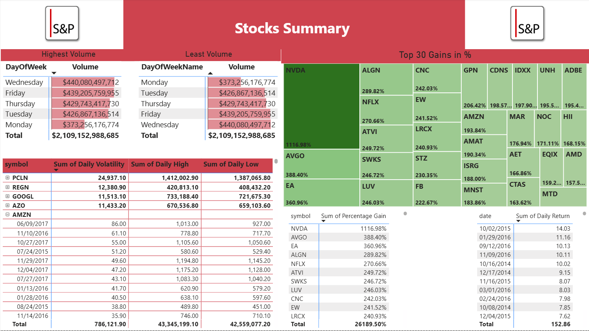
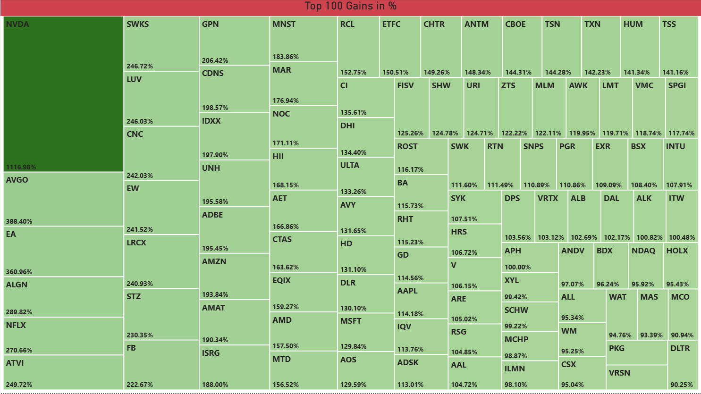
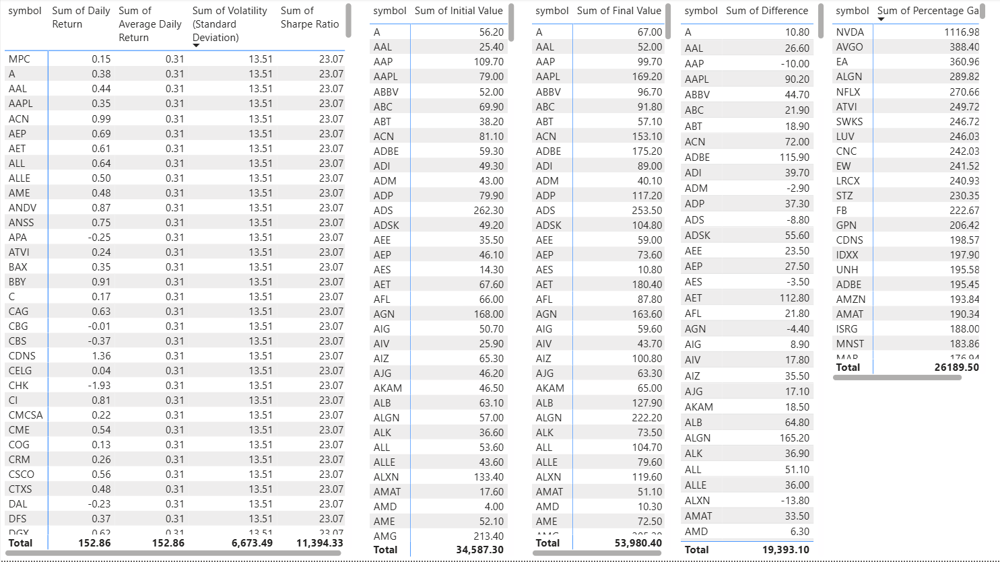

# S&P 500 Market Analysis

S&P 500 daily prices 2014-2017: volume, volatility and gainers.


---

## About

Four pages over four years of S&P 500 daily stock prices: a top-volume summary, a stock
summary, top gainers, and a page showing the intermediate calculations.

Most of the work here is in the model rather than in measures - eleven tables, and the
calculated ones carry the analysis: `Daily Volatility by Stocks and Dates`,
`Percentage Gain by Symbol`, `Initial Values` and `Final Values` with an
`Initial and Final Value Difference` between them, and `MaxVolumeRow` with its
`Max Volume Dates` companions. Only two DAX measures sit on top - `Date of largest volume`
and `Weekdays volume` - because the heavy lifting is done in calculated tables first. At
16 MB it holds the largest dataset in this folder.

---

## Contents

| | |
|---|---|
| **Pages** | 4 documented |
| **Visual types** | 9 - pivotTable, image, actionButton, tableEx, card, textbox, treemap, slicer, ... |
| **Model** | 11 tables, 2 DAX measures, 43 distinct fields on the pages |
| **File** | [`s&p 500.pbix`](s&p%20500.pbix) - 16.2 MB |

> **The data is inside the file.** The model is imported, so the report opens and
> renders in Power BI Desktop without the original source dataset, which is not
> included here.

---

## Every page

**1. Top Volume Summary** - 12 visuals


**2. Stock Summary** - 11 visuals



**3. Top Gainers** - 1 visuals



**4. others Calculation** - 5 visuals



---

## DAX measures

Read out of the report definition, so this is what the pages actually use:

```
Date of largest volume, Weekdays volume
```

## Status

Earlier work, kept for the record. There is no build script, no automated
validation and no reproducible data pipeline here - unlike the five projects in
the root of this repository. What is documented above was read directly out of
the `.pbix`, and every screenshot is the report rendering its own embedded data.
