# Spotify Audio Features

Do Spotify's audio features move together? Fifteen pages of testing it.

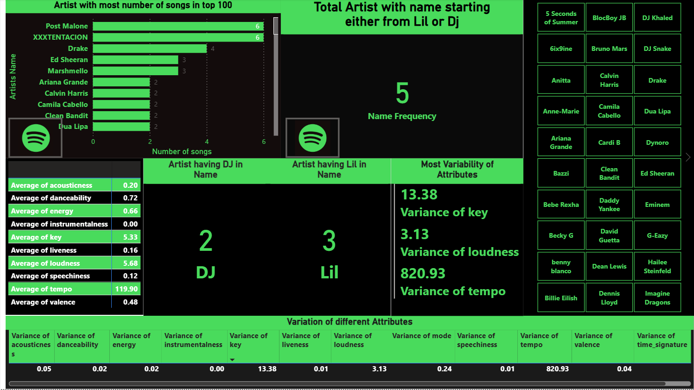

---

## About

An exploratory correlation study rather than a dashboard, and honest about being one.
Page one profiles the artists; the remaining fourteen work through Spotify's audio
features - acousticness, danceability, energy, instrumentalness, key, liveness, loudness,
mode, speechiness, tempo, time signature and valence - plotting each against the others.

There are **91 scatter charts** in the file, plus a strong-correlation and a
weak-correlation heatmap that sort the pairs by how much they actually move together. The
measures are the feature averages (`Avg Danceability`, `Avg Energy`, `Avg Valence` and so
on) with `artist_no_songs` and `Name Frequency` supporting the artist page.

The finding the layout implies is the useful one: most audio features are close to
independent, and only a few pairs - loudness and energy foremost - track each other.

---

## Contents

| | |
|---|---|
| **Pages** | 15 documented |
| **Visual types** | 9 - scatterChart, card, pivotTable, image, actionButton, clusteredBarChart, slicer, tableEx, ... |
| **Model** | 3 tables, 14 DAX measures, 39 distinct fields on the pages |
| **File** | [`Spotify Project PBI.pbix`](Spotify%20Project%20PBI.pbix) - 0.2 MB |

> **The data is inside the file.** The model is imported, so the report opens and
> renders in Power BI Desktop without the original source dataset, which is not
> included here.

---

## Every page

**1. Artist Info** - 12 visuals


**2. Weak Heatmap** - 1 visuals

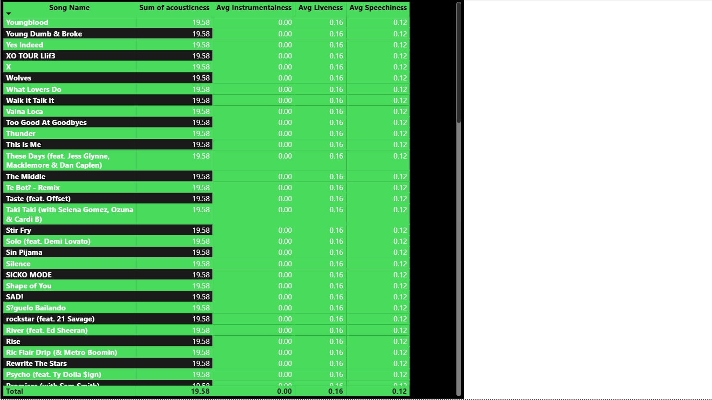

**3. Strong Heatmap** - 1 visuals

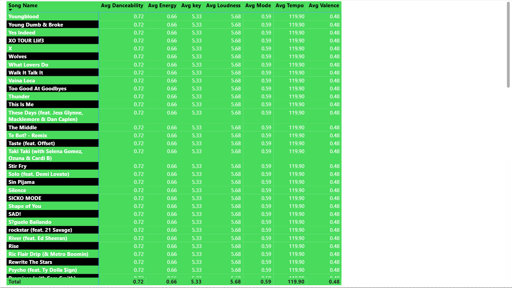

**4. Strong_Corelation** - 8 visuals

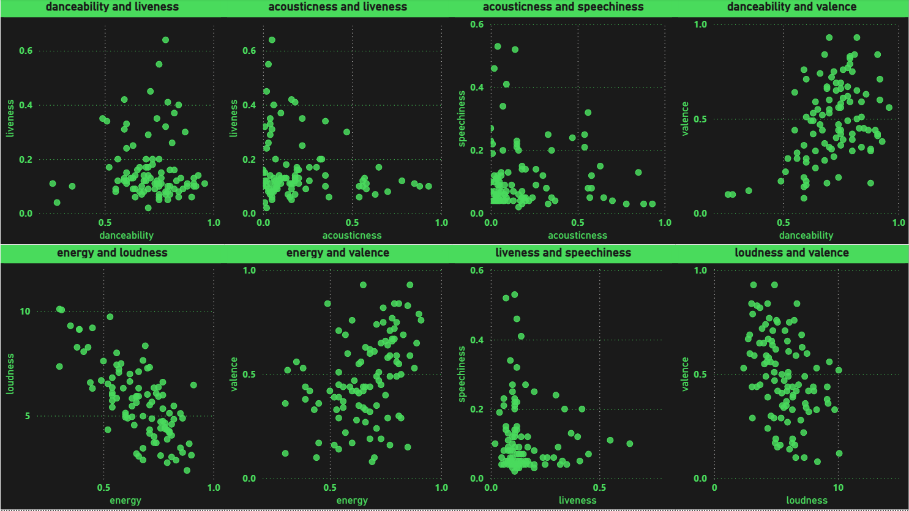

**5. Weak Corelation** - 12 visuals

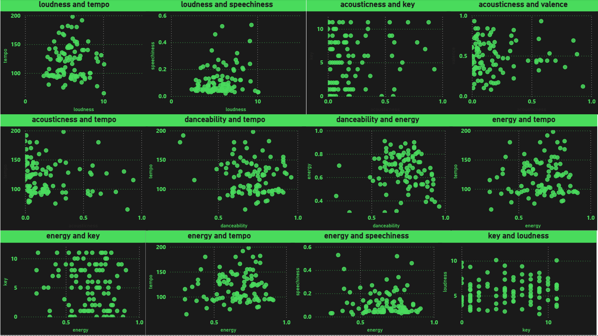

**6. Acousticness vs other** - 8 visuals

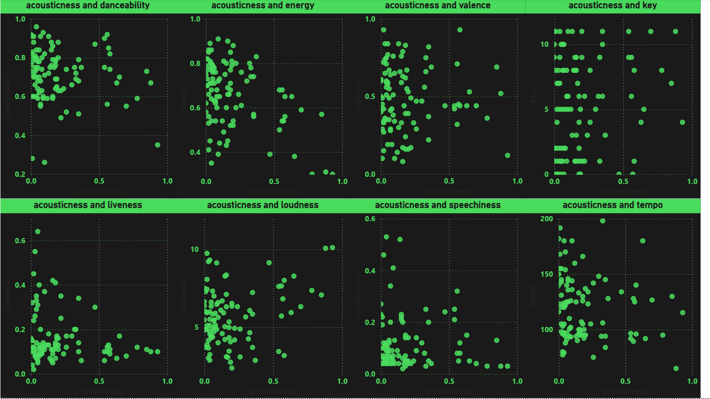

**7. danceability vs other** - 8 visuals

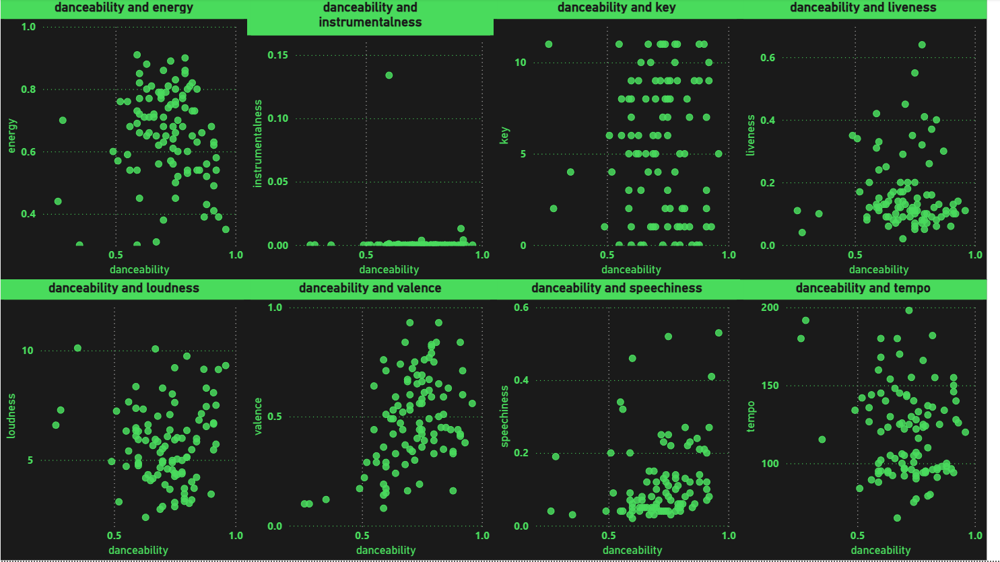

**8. Energy vs other** - 8 visuals

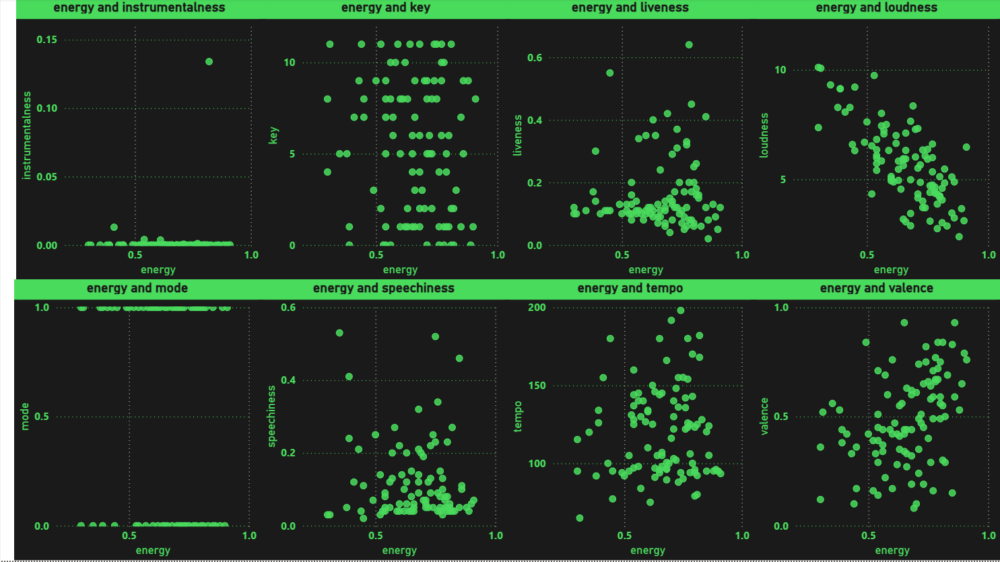

**9. Weak Corelation** - 11 visuals

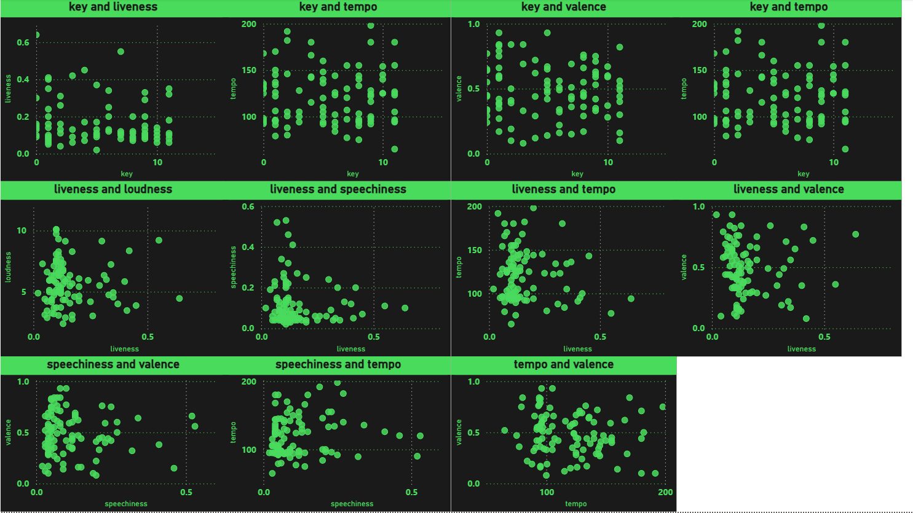

**10. Instrumentalness vs other** - 8 visuals

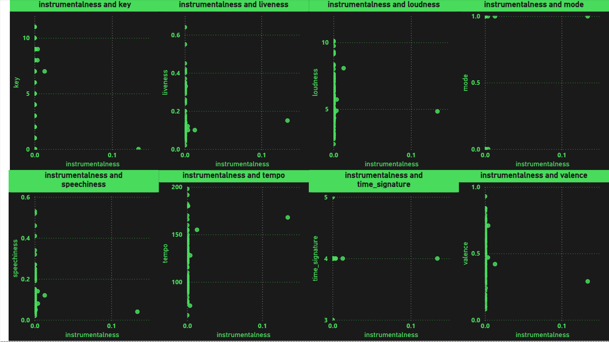

**11. Key vs other** - 7 visuals

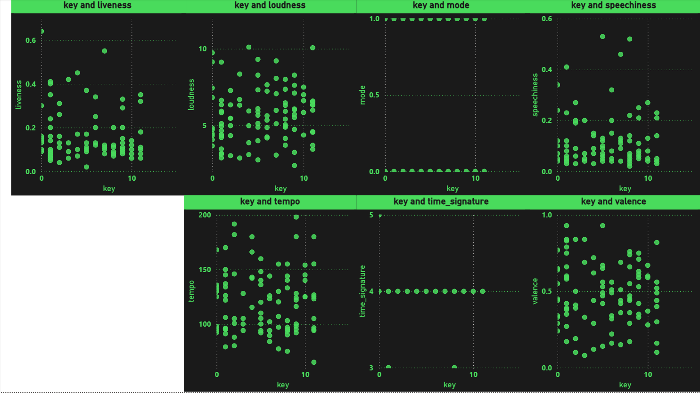

**12. Liveness vs Other** - 6 visuals

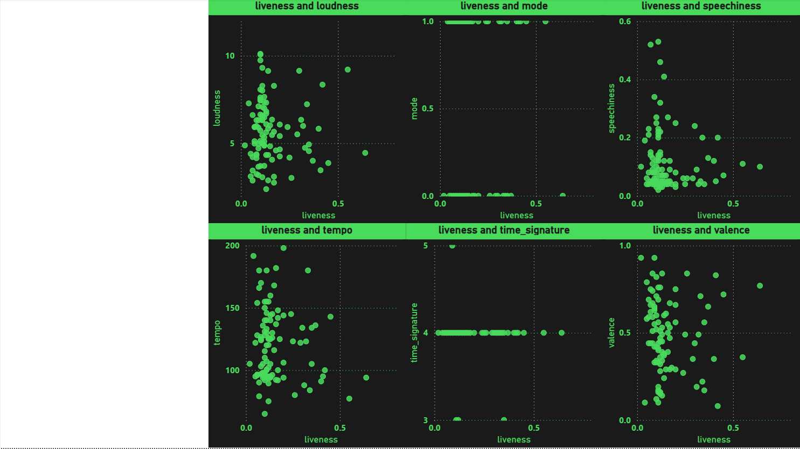

**13. Loudness vs other** - 5 visuals

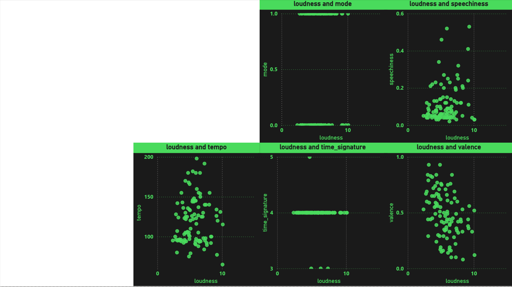

**14. Mode& Speechiness vs other** - 7 visuals

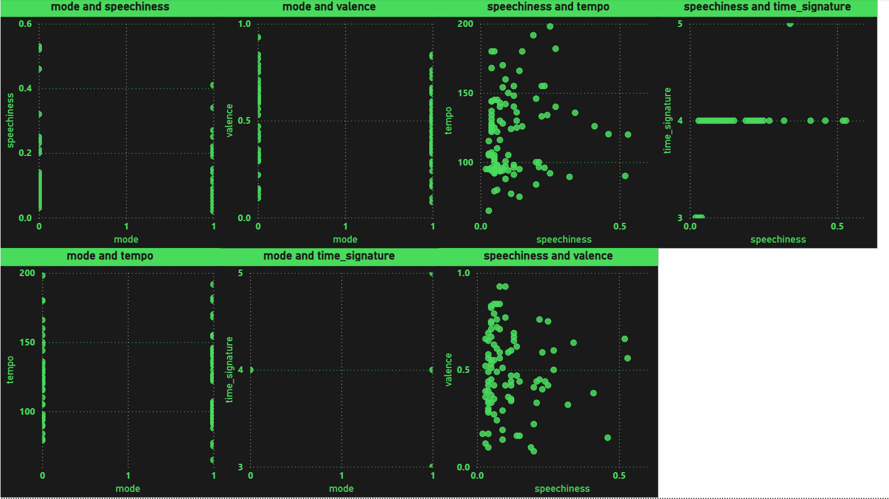

**15. Tempo and Time Signature and valence** - 3 visuals

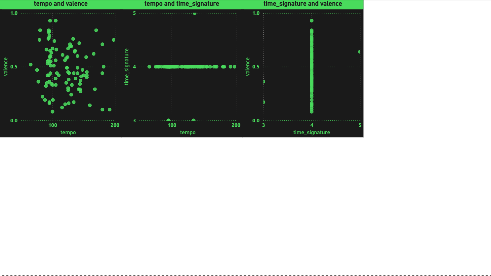

---

## DAX measures

Read out of the report definition, so this is what the pages actually use:

```
Avg Danceability, Avg Energy, Avg Instrumentalness, Avg Liveness, Avg Loudness, Avg Mode, Avg Speechiness, Avg Tempo, Avg Valence, Avg key, DJ, Lil, Name Frequency, artist_no_songs
```

## Status

Earlier work, kept for the record. There is no build script, no automated
validation and no reproducible data pipeline here - unlike the five projects in
the root of this repository. What is documented above was read directly out of
the `.pbix`, and every screenshot is the report rendering its own embedded data.
